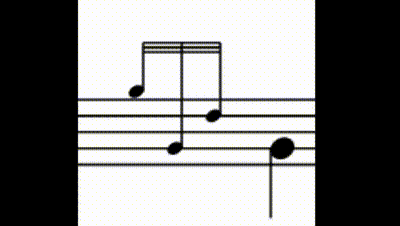

# PipeScore

## A bagpipe notation app

PipeScore is designed around reactive gracenotes - pipe embellishments that automatically update when you change the note that they are on. This means gracenotes can be added in sets (e.g. 'add a doubling to this note') rather than the user having to individually pick the correct one.



[Watch the video](https://pipescore.web.app/help) for an introduction to using PipeScore.

It is currently under development - see `todo.md` for a rough roadmap.

PipeScore is powered by:

- [typescript](https://www.typescriptlang.org/)
- [mithril](https://mithril.js.org/) for rendering
- [firebase](https://firebase.google.com) for saving, user accounts, and hosting, via the following libraries:
  - [firebase-auth-lite](https://github.com/samuelgozi/firebase-auth-lite)
  - [firebase-firestore-lite](https://github.com/samuelgozi/firebase-firestore-lite)
- [esbuild](https://github.com/evanw/esbuild) for building
- [eslint](https://eslint.org/) for linting
- [prettier](https://prettier.io) for code formatting

To learn more about how it works, have a look at the README in `src/PipeScore`.

## Features

Piping features:

- Reactive embellishments
- Undo / redo
- Ties
- Triplets
- Repeats and Second timings
- Time signatures
- Text boxes
- Automatic note grouping
- Bars/Staves/e.t.c.

Programming features:

- ~7000 source lines of TypeScript

## Running locally

You will need:

- `python3` (and `pip3`)
- `npm`

To install dependencies, run:

```bash
$ npm install            # install JS dependencies
$ pip3 install svgwrite  # install svgwrite, for building icons
```

To build JS files, icons and HTML pages, run:

```bash
$ npm run build     # build JS, static pages and icons
```

Run the following commands to run locally, ideally in separate terminals:

```bash
$ npm run dev       # run the development server
$ npm run watch     # rebuild JS on changes
$ npx tsc --watch   # typecheck
```

To build a production JS bundle run:

```bash
$ npm run build    # build minified bundle
```
